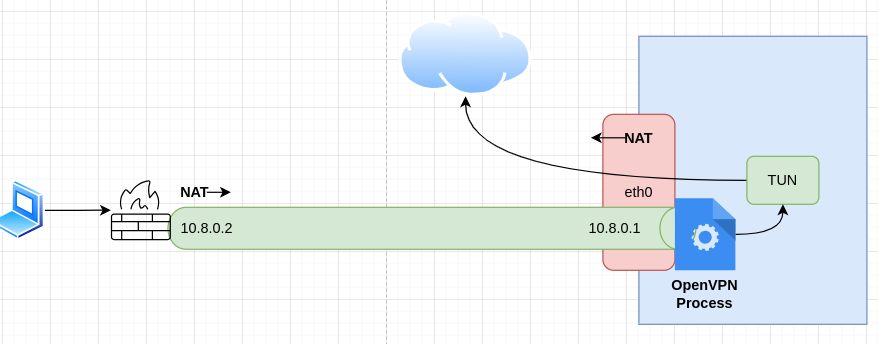

## Simple OpenVPN Server

This is a simple OVPN server config using only TLS authentication, ideally designed to have a firewall or a home router connect to it for IP anonymization rather than S2S connectivity. You are NATed out of the same public IP you connect to.

> [!NOTE]
> When configuring certificates, it's important to get the Extended key usage (EKU) correct. OpenVPN is picky about this. The Extended Key usage for the client cert must be ' TLS Web Client Authentication', for the server certificate, it must be 'TLS Web Server Authentication'



Here is the final file structure.

```plaintext
.
└── /etc/
    └── openvpn/
        ├── server/
        │   ├── ca.crt
        │   ├── server.crt
        │   ├── server.key
        │   ├── ta.key
        │   └── server.conf
        ├── openvpn-shutdown.sh
        └── openvpn-startup.sh
```


### Installation
1. Install OpenVPN server https://openvpn.net/community-docs/installing-openvpn.html
2. Clone openvpn folder of this repo somewhere in your home direcroty for easy initial editing.
3. Generate TLS auth key `openvpn --genkey secret ta.key` and place in `/server`
4. Generate/Acquire the certificate and key and place in `/server`
5. Enable IP forwarding `echo 'net.ipv4.ip_forward = 1' > /etc/sysctl.conf
sysctl -p && sysctl -p`
6. Edit the `openvpn-startup.sh` script and make changes according to your environment, that script assumes you are using 10.8.0.0/24 for your client IP pool and your outside interface is eth0
7. Copy everything into /etc/openvpn/
8. Ensure root is owner and group for everything in /etc/openvpn
9. Run the openvpn-startup.sh script as root.


### Logging

All logging information is under /var/log/openvpn


